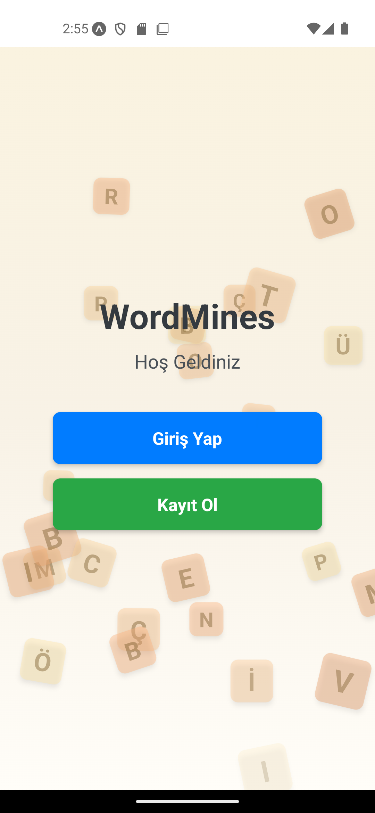
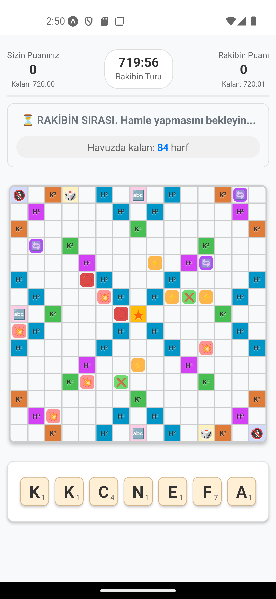
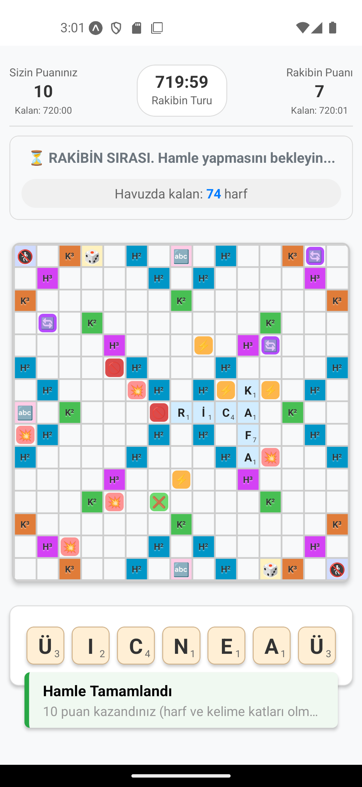
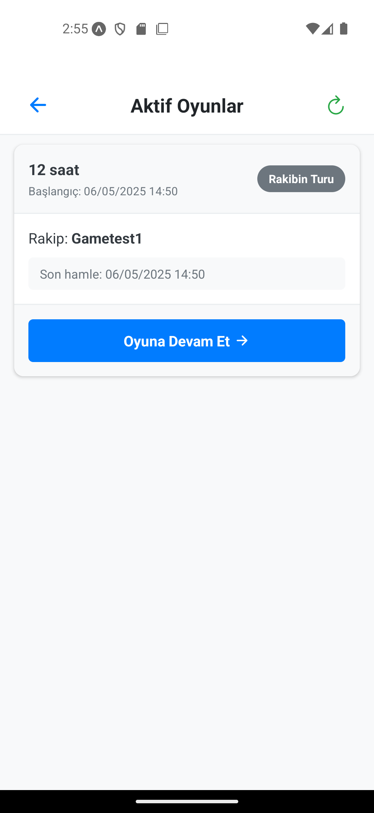

# WordMines

WordMines, kelime oluşturma ve stratejik düşünme becerilerini test eden, Türkçe dili için geliştirilmiş çevrimiçi bir kelime oyunudur. Scrabble/Kelime Avı tarzı mekaniklere sahip, kullanıcıların birbirleriyle rekabet ettiği bir mobil oyun uygulamasıdır.

## 💎 Özellikler

- **Çevrimiçi Çok Oyunculu Oyun**: Gerçek zamanlı olarak diğer oyuncularla oynayabilme
- **Kullanıcı Hesapları**: Kayıt olma, giriş yapma ve istatistikleri görüntüleme
- **Farklı Oyun Süreleri**: Kısa (2 dakika), normal (5 dakika), uzun (12 saat) veya günlük (24 saat) oyun süreleri arasında seçim yapabilme
- **Türkçe Kelime Desteği**: Türkçe alfabeye ve kelime dağarcığına uygun tasarım, 100.000+ Türkçe kelime içeren sözlük
- **Sürükleyici Arayüz**: Animasyonlar ve görsel efektlerle zenginleştirilmiş kullanıcı deneyimi
- **İstatistikler ve Sıralamalar**: Oyun istatistiklerini görme ve diğer oyuncularla karşılaştırma
- **Kelime Doğrulama**: Geçerli Türkçe kelimelerin otomatik kontrolü ve renkli geri bildirim
- **Puan Hesaplama**: Kelimelerin ve özel karelerin etkisiyle otomatik puan hesaplama ve gösterimi
- **Harf Dağılımı**: Türkçe'nin özelliklerine uygun harf dağılımı ve puan sistemi
- **Rakip Bulma**: Otomatik eşleştirme sistemi ile hızlıca rakip bulma
- **Bildirimler**: Oyun sırası size geldiğinde bildirim alma
- **Oyun Geçmişi**: Tamamlanan oyunların detaylı geçmişini görüntüleme
- **Mayın Sistemi**: Oyun tahtasına gizlenmiş, oyunu zorlaştıran farklı türlerde mayınlar
- **Görsel Ödüller**: Oyun tahtasında stratejik avantaj sağlayan özel karelerin varlığı

## 📱 Ekran Görüntüleri
   Daha sonra eklenecek.

<div align="center">
   <table>
    <tr>
      <td align="center"><b>Açılış Ekranı</b></td>
      <td align="center"><b>Oyun Tahtası</b></td>
      <td align="center"><b>Oyundan Kareler 1</b></td>
      <td align="center"><b>Oyundan Kareler 2</b></td>
      <td align="center"><b>Aktif Oyunlar</b></td>
    </tr>
    <tr>
      <td></td>
      <td></td>
      <td></td>
      <td></td>
      <td></td>
    </tr>
  </table>
</div>

## 🎮 Nasıl Oynanır

1. Kayıt olun veya mevcut hesabınızla giriş yapın
2. Ana ekranda "Yeni Oyun" seçeneğini kullanarak oyun başlatın
3. Oyun süresi seçeneğini belirleyin:
   - Hızlı Oyun: 2 dakika
   - Normal Oyun: 5 dakika
   - Uzun Oyun: 12 saat
   - Günlük Oyun: 24 saat
4. Rakip bulma ekranında bekleyin veya arkadaşınızı davet edin
5. Oyun başladığında size verilen 7 harften birini seçip tahtaya yerleştirin
6. İlk hamle mutlaka yıldız işaretli merkez kareye yapılmalıdır
7. Anlamlı kelimeler oluşturmak için harfleri stratejik bir şekilde yerleştirin
8. Özel kareleri (H², H³, K², K³) kullanarak puanınızı artırın
9. Mayınlara dikkat edin! Harflerinizi yerleştirdiğiniz kare bir mayın içerebilir
10. Hamlenizi onaylamak için "ONAYLA" düğmesine basın
11. Sıra rakibinize geçecektir
12. Oyun torbasındaki tüm harfler bittiğinde veya her iki oyuncunun da süresi dolduğunda oyun sona erer
13. En yüksek puanı alan oyuncu kazanır

## 📝 Kelime Yazma Kuralları

- Sıra sizde olduğunda, elinizdeki harflerle tahtada bulunan harflerden en az birine temas edecek şekilde kelime(ler) oluşturmalısınız
- İlk hamle mutlaka ortadaki yıldız (★) işaretli kareye yapılmalıdır
- Yerleştirdiğiniz harfler ya yatay ya da dikey bir düzende olmalıdır (çapraz yerleştirme yoktur)
- Temas ettiğiniz komşu harflerle birden fazla anlamlı kelime oluşturabilirsiniz
- Yerleştirdiğiniz harflerle oluşturulan tüm kelimeler anlamlı olmalıdır:
  - **Geçerli kelimeler** yeşil renkle gösterilir
  - **Geçersiz kelimeler** kırmızı renkle gösterilir
- Kelimeler en az 2 harften oluşmalıdır
- Kelimelerin sağ altında, o kelimeden kazanacağınız toplam puan gösterilir
- Yerleştirdiğiniz harfler arasında boşluk bırakamazsınız
- Joker (*) harfleri istediğiniz harf yerine kullanabilirsiniz, ancak puan değeri yoktur

## 🌟 Özel Kare Tipleri ve Puan Sistemi

### Özel Kare Tipleri
- **H²**: Harf puanını 2 katına çıkarır (Mavi renkli)
- **H³**: Harf puanını 3 katına çıkarır (Mor renkli)
- **K²**: Kelime puanını 2 katına çıkarır (Yeşil renkli)
- **K³**: Kelime puanını 3 katına çıkarır (Turuncu renkli)
- **★**: Oyuna başlangıç noktası (ortadaki kare, sarı renkli)

### Harf Puanları
- **1 Puan**: A, E, İ, K, L, N, R, T
- **2 Puan**: I, M, O, S, U
- **3 Puan**: B, D, Ü, Y
- **4 Puan**: C, Ç, Ş, Z
- **5 Puan**: G, H, P
- **7 Puan**: F, Ö, V
- **8 Puan**: Ğ
- **10 Puan**: J
- **0 Puan**: Joker (*)

### Puan Hesaplama
1. Her harf kendi puan değeriyle hesaplanır
2. H² karesine konulan harf, o harfin puanını 2 ile çarpar
3. H³ karesine konulan harf, o harfin puanını 3 ile çarpar
4. Tüm harflerin puanları toplandıktan sonra, kelime K² karesinden geçiyorsa toplam 2 ile çarpılır
5. Tüm harflerin puanları toplandıktan sonra, kelime K³ karesinden geçiyorsa toplam 3 ile çarpılır
6. Bir hamlede birden fazla kelime oluşturulursa, tüm kelimelerin puanları toplanır

## 💣 Mayın Sistemi

WordMines'ta, oyun tahtasında gizli olan ve keşfedildiğinde çeşitli olumsuz etkilere sahip olan mayınlar bulunur. Oyuna stratejik bir derinlik katan bu sistem, dikkatli hamle yapmayı gerektirir.

### Mayın Türleri

- **Puan Bölünmesi (💥)**: Oyuncunun bu hamleden kazanacağı puanın %30'unu alır. Oyun başına 5 adet bulunur.
- **Puan Transferi (⚡)**: Oyuncunun bu hamleden kazanacağı puanın tamamını rakibe aktarır. Oyun başına 4 adet bulunur.
- **Harf Kaybı (🔄)**: Oyuncunun elindeki tüm harfleri kaybetmesine ve yeni 7 harf almasına sebep olur. Oyun başına 3 adet bulunur.
- **Bonus Blocker (❌)**: Bu hamle sırasında kullanılan özel karelerin (H², H³, K², K³) etkisini iptal eder. Oyun başına 2 adet bulunur.
- **Kelime İptali (🚫)**: Oyuncunun bu hamleden hiç puan alamamasına sebep olur. Oyun başına 2 adet bulunur.

### Mayın Mekanikleri

- Mayınlar oyun tahtasında başlangıçta gizlidir ve ancak üzerine bir harf yerleştirildiğinde tetiklenir
- Bir mayın patladığında görünür olur ve etkisini hemen gösterir
- Oyuncular mayın yerlerini tahmin etmeli ve hamle stratejilerini buna göre ayarlamalıdır
- Mayınlar oyunun zorluğunu ve stratejik derinliğini artırır

## 🎁 Görsel Ödül Sistemi

Oyun tahtasında, oyuncuların stratejik avantaj elde etmesini sağlayan özel ödül kareleri bulunur.

### Ödül Türleri

- **Bölge Yasağı (🚷)**: Tahtanın köşelerinde (2 adet) bulunur. Bu ödülü alan oyuncu, rakibinin bir sonraki hamlesinde belirli bir bölgeye harf yerleştirmesini engelleyebilir.
- **Harf Yasağı (🔤)**: Tahtanın kenarlarının ortasında (3 adet) bulunur. Bu ödülü alan oyuncu, rakibinin belirli bir harfi kullanmasını yasaklayabilir.
- **Ekstra Hamle Jokeri (🎲)**: Tahtanın kenarlarının çeyreklerinde (2 adet) bulunur. Bu ödülü alan oyuncu, ekstra bir hamle hakkı kazanır.

### Ödül Mekanikleri

- Görsel ödüller, üzerlerine harf yerleştirildiğinde aktif hale gelir
- Her ödül türü farklı renk ve simge ile temsil edilir
- Ödüller, sınırlı sayıda bulunur ve stratejik konumlara yerleştirilmiştir
- Ödüller, oyun dengesini bozmadan oyuna farklı bir boyut kazandırır

## 🚀 Kurulum ve Geliştirme

### Gereksinimler
- Node.js 14.0 veya üstü
- npm veya yarn
- Expo CLI
- Firebase hesabı

### Kurulum Adımları

1. Projeyi klonlayın
   ```bash
   git clone https://github.com/MerttMetinn/WordMines.git
   cd wordmines
   ```

2. Bağımlılıkları yükleyin
   ```bash
   npm install
   # veya
   yarn install
   ```

3. Firebase yapılandırması
   - Firebase konsolundan yeni bir proje oluşturun
   - Authentication ve Firestore hizmetlerini etkinleştirin
   - `app/firebase.ts` dosyasını Firebase projenizdeki konfigürasyon bilgileriyle güncelleyin

4. Uygulamayı geliştirme modunda başlatın
   ```bash
   npx expo start
   # veya
   npm run start
   ```

### Proje Yapısı

```
wordmines/
├── app/                  # Ana uygulama kodu
│   ├── components/       # Yeniden kullanılabilir bileşenler
│   ├── game/             # Oyun ekranları ve mantığı
│   ├── auth/             # Kimlik doğrulama ilgili ekranlar
│   ├── utils/            # Yardımcı fonksiyonlar ve sabitler
│   └── firebase.ts       # Firebase yapılandırması
├── assets/               # Statik dosyalar (görseller, fontlar, ses)
│   └── wordlist.txt      # Türkçe kelime listesi
├── README.md             # Proje açıklaması
└── package.json          # Paket bağımlılıkları
```

## 🔧 Kullanılan Teknolojiler

- **Frontend**:
  - React Native / Expo (UI framework)
  - TypeScript (Tip güvenliği için)
  - React Navigation / Expo Router (Ekran geçişleri)
  - Reanimated 2 (Akıcı animasyonlar için)
  - React Native Gesture Handler (Dokunma ve hareket işlemleri)

- **Backend**:
  - Firebase Authentication (Kullanıcı yönetimi)
  - Firestore (Veritabanı ve gerçek zamanlı veri)
  - Firebase Cloud Functions (Sunucu taraflı mantık)
  - Firebase Cloud Messaging (Bildirimler)

- **Performans & Optimizasyon**:
  - Memoization teknikleri
  - Lazy loading
  - Firebase veritabanı kuralları
  - Expo Asset caching

## 📱 Desteklenen Platformlar

- **Android** (API 21+)
- **iOS** (13.0+)
- **Web** (Sınırlı Destek)

## 🔄 Dil Desteği

- Türkçe

## 📜 Lisans

Bu proje [MIT Lisansı](LICENSE) altında lisanslanmıştır.

---

Wordmines Oyun Projesi © 2025
